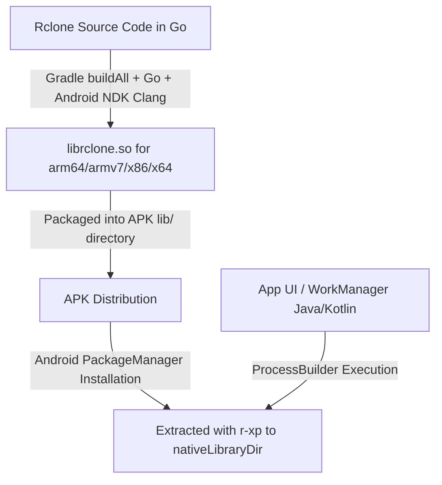

# Rclone Core Integration & Native Shared Library (`librclone.so`) Guide

This document explains the architecture, compilation process, Android security constraints, and execution runtime of the native `librclone.so` binary within **Multi Cloud File Manager** (Round Sync).

---

## 1. Executive Overview

The core engine responsible for cloud storage interactions, file transfers, encryption, and synchronization is [rclone](https://rclone.org/), written in **Go**.

Since Android applications run on the Java/Kotlin Virtual Machine (Dalvik/ART), the rclone Go codebase is cross-compiled into native shared binaries packaged as `librclone.so` for each supported CPU architecture.

---

## 2. Why `librclone.so`? (Android Security & Packaging Mechanics)

### The W^X Security Enforcement (Android 10+ / API 29+)
Starting with Android 10, the Android OS enforces **W^X (Write XOR Execute)** security policies:
- Applications are strictly prohibited from executing binaries residing within app-writable data directories (e.g., `/data/data/<package_name>/files/`).
- The **only** directory where native binary execution is permitted is the application's native library directory (`nativeLibraryDir`).

### APK Package Extraction
The Android Package Manager (`PackageManager`) inspects the `lib/<ABI>/` directory inside the APK during installation:
- Only files prefixed with `lib` and ending in `.so` are extracted into `nativeLibraryDir`.
- Extracted `.so` files are granted read and execute (`r-xp`) filesystem permissions by the OS.
- Therefore, the rclone binary is compiled and renamed to `librclone.so` in the Gradle build script ([`rclone/build.gradle`](../rclone/build.gradle#L131)) so Android treats it as an executable native shared library.

---

## 3. Cross-Compilation Pipeline (`rclone/build.gradle`)

The rclone build script handles cross-compilation for four Android ABIs:

| Target ABI | CPU Architecture | Environment Settings |
|---|---|---|
| `arm64-v8a` | 64-bit ARM | `GOARCH=arm64` |
| `armeabi-v7a` | 32-bit ARM v7 | `GOARCH=arm`, `GOARM=7` |
| `x86` | 32-bit x86 (Emulator) | `GOARCH=386` |
| `x86_64` | 64-bit x86 (Emulator / Devices) | `GOARCH=amd64` |

### Key Build Settings:
- **CGO Enabled**: `CGO_ENABLED=1` is enabled to link against Android NDK C runtime libraries (`libc`, `libm`, `libdl`).
- **NDK Clang Toolchain**: Android NDK Clang cross-compiler is passed via the `CC` and `CC_FOR_TARGET` environment variables.
- **Go Build Command**:
  ```bash
  go build -tags "android noselfupdate" -trimpath -ldflags "..." -o app/lib/<ABI>/librclone.so github.com/rclone/rclone
  ```

---

## 4. Execution & Subprocess Runtime

The application interacts with `librclone.so` by invoking it as a native process:

### Location Resolution
In [`Rclone.java`](../app/src/main/java/org/openinit/multicloudfilemanager/Rclone.java#L81):
```java
this.rclone = context.getApplicationInfo().nativeLibraryDir + "/librclone.so";
```

### Process Execution
When a sync or file action is triggered:
1. Java constructs the command array (e.g., `["/data/app/.../lib/arm64/librclone.so", "sync", "remote:dir", "local:dir", "--config", "rclone.conf"]`).
2. The command is launched via `ProcessBuilder` or `Runtime.getRuntime().exec()`.
3. Standard output and error streams are captured by the app for progress tracking and log logging.

---

## 5. Architecture Pipeline Diagram


