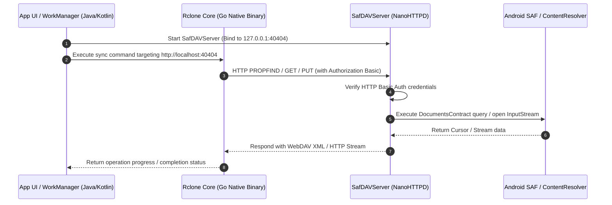

# Storage Access Framework WebDAV Adapter (`safdav`) Architecture & Security Guide

This document provides a comprehensive technical overview of the `safdav` module in **Multi Cloud File Manager** (Round Sync), explaining its purpose, internal architecture, security design, and industry standard patterns.

---

## 1. Overview & Purpose

### The Problem
- **Android Scoped Storage & SAF**: Modern Android versions enforce the **Storage Access Framework (SAF)** (`DocumentsContract` / `content://` URIs) for accessing external storage media (SD cards, USB OTG drives) and restricted app directories.
- **Native Engine Limitation**: The core sync engine, [rclone](https://rclone.org/), is written in **Go** and compiled as a native C-shared library (`.so`). Go operates on standard POSIX file paths (`/path/to/file`) and lacks native capabilities to query Android's `ContentResolver` or JVM-based SAF interfaces directly.

### The Solution (`safdav`)
The `safdav` module acts as an in-app **Virtual File System (VFS) / WebDAV Proxy**:
1. It launches a lightweight, embedded WebDAV HTTP server (`SafDAVServer`) on `localhost`.
2. `rclone` connects to `http://localhost:<port>` as a standard WebDAV remote backend.
3. `safdav` intercepts incoming HTTP WebDAV verbs (`PROPFIND`, `GET`, `PUT`, `MKCOL`, `MOVE`, `COPY`, `DELETE`) and translates them on-the-fly into Android `DocumentsContract` / SAF calls.

---

## 2. Component Breakdown

The module is structured under `io.github.x0b.safdav` within the [`safdav/`](../safdav) module:

| Component | File Path | Responsibilities |
|---|---|---|
| **`SafDAVServer`** | [`SafDAVServer.java`](../safdav/src/main/java/io/github/x0b/safdav/SafDAVServer.java) | Extends `NanoHTTPD`. Listens on loopback HTTP port `40404`, parses WebDAV requests/headers, enforces Basic Authentication, and routes actions to the SAF access layer. |
| **`SafDirectServer`** | [`SafDirectServer.java`](../safdav/src/main/java/io/github/x0b/safdav/SafDirectServer.java) | Provides direct Java/Kotlin file manipulation methods bypassing HTTP network overhead for internal UI operations. |
| **`SafAccessProvider`** | [`SafAccessProvider.java`](../safdav/src/main/java/io/github/x0b/safdav/SafAccessProvider.java) | Singleton manager handling server lifecycle and generating/persisting 128-bit `SecureRandom` HTTP Basic Authentication credentials. |
| **`DocumentsContractAccess`** | [`DocumentsContractAccess.java`](../safdav/src/main/java/io/github/x0b/safdav/saf/DocumentsContractAccess.java) | Wraps Android `ContentResolver` operations, querying SAF document trees, opening input/output streams, and performing file/folder operations. |
| **`SingleRootProvider`** | [`SingleRootProvider.java`](../safdav/src/main/java/io/github/x0b/safdav/provider/SingleRootProvider.java) | Implementation of Android `DocumentsProvider` to present virtual storage roots to the Android OS file picker. |

---

## 3. Sequence Flow Diagram

The diagram below illustrates the end-to-end request flow during a synchronization task:

---

## 4. Security Model & Threat Analysis

### A. Implemented Security Controls

1. **Strict Loopback Binding (`127.0.0.1`)**:
   - `SafDAVServer` explicitly binds to `hostname = "localhost"` (`127.0.0.1`).
   - Network interfaces connected to external Wi-Fi, Ethernet, or Cellular networks **cannot** route traffic to this port.

2. **Per-Installation Random Credentials (128-bit Entropy)**:
   - On first run, [`SafAccessProvider`](../safdav/src/main/java/io/github/x0b/safdav/SafAccessProvider.java#L42-L50) generates a 16-byte random password using `java.security.SecureRandom` and stores it in private app `SharedPreferences`.
   - `SafDAVServer` enforces `Authorization: Basic <credentials>` on **every single request**. Requests without valid credentials receive HTTP `401 Unauthorized`.

### B. Threat Vectors & Potential Vulnerabilities

| Threat | Risk Level | Description | Current Mitigation / Recommendation |
|---|---|---|---|
| **Local App Interception** | Medium | Any app with `INTERNET` permission on the device can probe `127.0.0.1:40404`. | Blocked by mandatory 128-bit HTTP Basic Auth. Unauthenticated requests are rejected immediately. |
| **Port Conflict / DoS** | Low | Static port `40404` can conflict with another service or be occupied by a malicious app. | **Future Hardening**: Implement dynamic free port selection during initialization. |
| **Rooted Device Inspection** | High | Root malware can read app `SharedPreferences` to extract the password or inspect local socket memory. | **Inherent Limit**: On rooted devices where Android sandbox controls are broken, app memory is accessible to root processes. |
| **Unencrypted Local HTTP** | Low | Local loopback traffic is sent in plaintext HTTP. | Acceptable performance tradeoff for local loopback (`127.0.0.1`), avoiding TLS certificate management overhead. |

---

## 5. Industry Standard Comparison

Is the **Local Loopback Adapter Pattern** an established design pattern? **Yes.**

Building a local HTTP/loopback server to bridge native code (C, C++, Go, Rust) with platform-specific APIs is a widely accepted architectural pattern across mobile and desktop applications:

- **VLC for Android & MPV**: Run local loopback HTTP/RTSP servers to pass Android SAF and `ContentProvider` streams to underlying native C/C++ rendering engines (`libvlc`/`libmpv`).
- **Syncthing Android**: Uses local HTTP loopback adapters to bridge Android system storage and SAF permissions with the core Syncthing Go daemon.
- **Termux & PRoot**: Use local sockets and loopback proxies to intercept and emulate POSIX filesystem APIs on Android.
